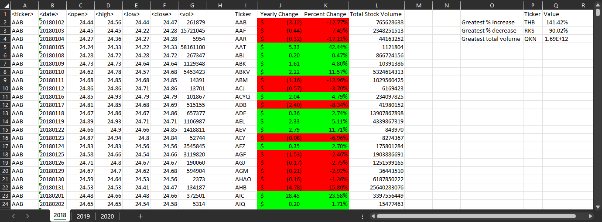

# VBA-challenge
This repository contains a VBA scripting example to summarize and format results of stock data contained in an excel file.

# Features

Use VBA to create a script that provides a summary table the includes the following for each ticker for each year (tab):
   * the ticker symbol
   * the yearly change from the opening price at the beginning of a given year to the closing price at the end of that year
   * the percentage change from the opening price at the beginning of a given year to the closing price at the end of that year
   * the total stock volume of the stock
Use VBA to create a separate summary table that includes the following for each year (tab)
   * return the stock with the "Greatest % increase"
   * return the stock with the "Greatest % decrease"
   * return the stock with the "Greatest total volume"
   * Make the appropriate adjustments to your VBA script to enable it to run on every worksheet (that is, every year) at once.
Use VBA to format the summary table as follows:
   * positive yearly changes and percent changes are highlighted green
   * negative yearly changes and percent changes are highlighted red

2018 Results

# File Notes
* VBA_Scripts\StocksummaryPerTab.vbs is the script that implements the requirements documented within the Instructions section with a summary on each tab. (makes sense for Multiple_year_stock_data workbook)
   * Note: This script assumes (per TA guidance) the the data is sorted alphadetically by ticker name then chronologicaly by date. This assumption allows for lighter processer usage during the analysis.
* The Results_Screenshots folder contains screenshots of each tab after executing the script on Multiple_year_stock_data.
   * MultiYearStock_20##Results are for each tab of the Multiple_year_stock_data workbook from using StocksummaryPerTab.vbs on the file. 

* The Starter_Code folder contains the excel files and screenshots provided in BCS/Canvas for completing the challenge.

# References
The following references were used to identify various functions used within the script:
 * Index: https://www.automateexcel.com/formulas/return-address-highest-value-in-range/
 * Max & Min: https://learn.microsoft.com/en-us/office/vba/api/excel.worksheetfunction#methods
 * Number Formatting: https://learn.microsoft.com/en-us/office/vba/api/excel.cellformat.numberformat
 * Autofit Formatting: https://learn.microsoft.com/en-us/office/vba/api/excel.range.autofit

# Getting Started

## Prerequisites
You must have Excel (trial or full account) to run the scripts.

## Cloning Repo
$ git clone https://github.com/vt-bekah/VBA-challenge.git

$ cd VBA-challenge

# Built With
* O365 Excel with VBA v2308 (Build 16731.20234)

